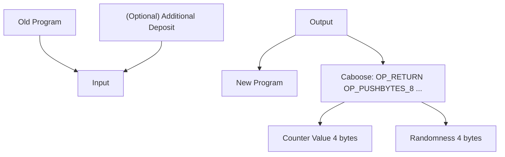

## covenants-gadgets

This repository implements Bitcoin script gadgets that make it easy for developers to build applications from Bitcoin 
script. In particular, it implements two tools for reflection in Bitcoin.
- [CAT and Schnorr tricks](https://medium.com/blockstream/cat-and-schnorr-tricks-i-faf1b59bd298) from Andrew Poelstra. 
Using the Schnorr signature scheme with a dummy public key and a dummy random element R (both are equal to the secp256k1 group 
generator), one can repurpose the Schnorr signature verification to get a hash of the key information in the transaction, which enables 
the input to perform a reflection on the transaction that is going to spend it. In short, it reflects on the current transaction.
- Reflection on the [txid](https://en.bitcoin.it/wiki/Transaction) (not wtxid) allows one to check key information about the transaction where this input was an output 
of that previous transaction. This is done by simply reconstructing a transaction without any segregated witness stuffs 
and compute its double SHA256. It relies on the CAT and Schnorr tricks, since it needs to obtain the outpoint information of the 
present transaction. In short, it reflects on the previous transaction.

These two tools allow one to build covenants. 

A minimalistic example, which implements a counter, is showcased in [Bitcoin-Wildlife-Sanctuary/covenants-examples](https://github.com/Bitcoin-Wildlife-Sanctuary/covenants-examples). It enforces that the counter can only be increased by one from the previous transaction each time.

Now we provide some background on the two tools discussed above.

### CAT and Schnorr tricks

In P2TR, `OP_CHECKSIGVERIFY` accepts the top stack element as the public key, and the second-to-top stack element as the 
signature. The public key is a compressed secp256k1 public key, and the signature is the Schnorr signature with an (optional) 
signature hash type byte.

The signing algorithm works as follows, with $x$ as the secret key and $Y = x\cdot G$ as the public key. 
1. Sample a random scalar field element: $k$.
2. Compute $R = k\cdot G$.
3. Compute $e = H(R || Y || m)$ where $m$ is the message.
4. Compute $s = k + xe$.

In the landmark article from Andrew Poelstra from Blockstream, it shows that if we use the secp256k1 group generator as 
the public key (meaning that $x = 1$) and the random point $R$ (meaning that $k = 1$), we can have $s = 1 + e$ where $e$ 
is almost like a hash of the message that can be recomputed inside the Bitcoin script using `OP_SHA256` and other opcodes
including `OP_CAT`. 

One may wonder why not pick $k = 0$ as it could give a cleaner expression $s = e$. This is indeed infeasible because in 
that case, the signature would be rejected due to $R$ being invalid.

There are many ways to handle the "+1" part. The article provides an idea: by tweaking the transaction without changing 
its utility, one can get different $e$, and with a possibility of about $1/256$, one would hit a hash that ends with 0x01. 
Replacing the last byte 0x01 with 0x02 gives the "+1" result, through some Bitcoin script that uses a hint.

Variants exist in practice. Taproot Wizards's [vault](https://github.com/taproot-wizards/purrfect_vault/) searches for 
$e$ ending at 0x00 and appending 0x01 on it, and it uses the sequence field to tweak the transaction. 
The [covenants-examples](https://github.com/Bitcoin-Wildlife-Sanctuary/covenants-examples) repository uses a more tedious 
approach, by making the caboose tweakable. In fact, it is possible to use many other numbers, not restricted to 0x01 or 
0x00. We just want to use a Bitcoin integer that only takes zero or one byte to represent. Nevertheless, the process of 
doing such tweaking, called "grinding", is generally very efficient.

The message in the hashing for $e$ is a hash of key elements in the script, including information about the input, the output, 
and input's outpoints and balances. One can find more detail in [BIP-341 "Taproot: SegWit version 1 spending rules"](https://github.com/bitcoin/bips/blob/master/bip-0341.mediawiki),
copy-pasted as follows. This is in general sufficient to build useful self reflection.

--------------

- Control:
  * ''hash_type'' (1).
- Transaction data:
  * ''nVersion'' (4): the ''nVersion'' of the transaction.
  * ''nLockTime'' (4): the ''nLockTime'' of the transaction.
  * If the ''hash_type & 0x80'' does not equal <code>SIGHASH_ANYONECANPAY</code>:
    - ''sha_prevouts'' (32): the SHA256 of the serialization of all input outpoints.
    - ''sha_amounts'' (32): the SHA256 of the serialization of all input amounts.
    - ''sha_scriptpubkeys'' (32): the SHA256 of all spent outputs' ''scriptPubKeys'', serialized as script inside <code>CTxOut</code>.
    - ''sha_sequences'' (32): the SHA256 of the serialization of all input ''nSequence''.
  * If ''hash_type & 3'' does not equal <code>SIGHASH_NONE</code> or <code>SIGHASH_SINGLE</code>:
    - ''sha_outputs'' (32): the SHA256 of the serialization of all outputs in <code>CTxOut</code> format.
- Data about this input:
  * ''spend_type'' (1): equal to ''(ext_flag * 2) + annex_present'', where ''annex_present'' is 0 if no annex is present, or 1 otherwise (the original witness stack has two or more witness elements, and the first byte of the last element is ''0x50'')
  * If ''hash_type & 0x80'' equals <code>SIGHASH_ANYONECANPAY</code>:
    - ''outpoint'' (36): the <code>COutPoint</code> of this input (32-byte hash + 4-byte little-endian).
    - ''amount'' (8): value of the previous output spent by this input.
    - ''scriptPubKey'' (35): ''scriptPubKey'' of the previous output spent by this input, serialized as script inside <code>CTxOut</code>. Its size is always 35 bytes.
    - ''nSequence'' (4): ''nSequence'' of this input.
  * If ''hash_type & 0x80'' does not equal <code>SIGHASH_ANYONECANPAY</code>:
    - ''input_index'' (4): index of this input in the transaction input vector. Index of the first input is 0.
  * If an annex is present (the lowest bit of ''spend_type'' is set):
    - ''sha_annex'' (32): the SHA256 of ''(compact_size(size of annex) || annex)'', where ''annex'' includes the mandatory ''0x50'' prefix.
- Data about this output:
  * If ''hash_type & 3'' equals <code>SIGHASH_SINGLE</code>:
    - ''sha_single_output'' (32): the SHA256 of the corresponding output in <code>CTxOut</code> format.

--------------

### Txid reflection

Txid is the double hash of everything in the transaction that is not a segregated witness stuff. To be precise, it includes 
the following information:
- transaction version number
- number of inputs
- serialized inputs
- number of outputs
- serialized outputs

Each serialized input includes the following information:
- outpoint
- script signature (empty for P2WPKH, P2WSH, P2TR)
- sequence number

Note that the script and witness elements are "segregated" and therefore they do not affect the txid. 

Each serialized output includes the following information:
- amount
- script public key

We use txid reflection to obtain the "previous state". This is done by putting the previous state information in one of 
the serialized output as a P2WSH UTXO. Since we are able to use reflection to find out the script public key, we are able 
to verify the information in that UTXO.

### Overview

Developers can start from the `wizards` folder to find out the Bitcoin script gadgets that suit their needs. There are 
six wizards, some of which are smaller wizards under bigger wizards.
- [tag_csv_preimage.rs](https://github.com/Bitcoin-Wildlife-Sanctuary/covenants-gadgets/blob/main/src/wizards/tap_csv_preimage.rs): 
a wizard that rebuilds the preimage for the taproot CheckSigVerify.
- [tx.rs](https://github.com/Bitcoin-Wildlife-Sanctuary/covenants-gadgets/blob/main/src/wizards/tx.rs): a wizard that rebuilds 
the preimage for calculating the txid.

The smaller wizards are as follows.
- [ext.rs](https://github.com/Bitcoin-Wildlife-Sanctuary/covenants-gadgets/blob/main/src/wizards/ext.rs): a smaller wizard 
that rebuilds the extension in the taproot CheckSigVerify. 
- [outpoint.rs](https://github.com/Bitcoin-Wildlife-Sanctuary/covenants-gadgets/blob/main/src/wizards/outpoint.rs): a smaller 
wizard that constructs the outpoint structure of an input.
- [tx_in.rs](https://github.com/Bitcoin-Wildlife-Sanctuary/covenants-gadgets/blob/main/src/wizards/tx_in.rs): a smaller 
wizard that reconstructs the transaction input for segwit UTXOs, without the witness.
- [tx_out.rs](https://github.com/Bitcoin-Wildlife-Sanctuary/covenants-gadgets/blob/main/src/wizards/tx_out.rs): a smaller 
wizard that reconstructs the transaction output.

<p align="center">
  
</p>

### Example

Currently, it contains one example: counter. It implements a monotonic counter that can only be increased by 1 each time.
Specifically, it only supports two operations:
- **Create a new counter:** one can create a new counter with an arbitrarily chosen initial counter value.
- **Increment the counter by 1:** each transaction can only spend the UTXO that represents the previous program and
  generates the new program that is carrying the new counter, which increases by 1.

We have experimented this design on Bitcoin signet. See [SIGNET.md](src/examples/SIGNET.md) for a full walkthrough and
how to reproduce it. We want to thank Taproot Wizards for the help with this demo.

#### Transaction flow

Each of the transactions in this covenant system has the following layout:

- TxIn:
  * old program, which is a P2TR of the counter update script
  * (optional) a deposit input, which deposits more money into the program for spending
- TxOut:
  * new program, which has the same P2TR address as the old program
  * caboose, described below, which carries the counter



#### Caboose: the state-carrying UTXO via P2WSH

The state is carried in an adjacent UTXO next to the new program. This is a pay-to-witness-script-hash (P2WSH) UTXO with
the following script.

```
OP_RETURN OP_PUSHBYTES_8 [4 bytes of counter value] [4 bytes of the randomizer] 
```

The reason that we use P2WSH rather than P2TR is that the P2TR taproot is a point on the secp256k1 curve that cannot be
easier "tweaked" inside Bitcoin script. However, P2WSH is just a tagged hash using OP_SHA256. When the new program is
being executed, it reflects on its own outpoint txid and obtains this adjacent UTXO. It can read data from the previous
state.

This technique was discussed in a blog article that L2 Iterative contributed to its portfolio company Polyhedra.
- https://hackmd.io/@polyhedra/bitcoin
- https://hackmd.io/@l2iterative/bitcoin-polyhedra

It is also discussed in the [CatVM book](https://catvm.org/catvm.pdf) in Rijndael's jorurnal.

A more high-level idea, which is to use txid reflection to look up the previous transaction, was used by Rijndael from
Taproot Wizards in their implementation of vaults called [purrfect-vault](https://github.com/taproot-wizards/purrfect_vault).
This was discussed in [Rijndael's talk](https://x.com/fede_intern/status/1787191430110151060) in Bitcoin++ Austin 2024.

Carter Feldman from [QED](https://qedprotocol.com/) implemented a way to split arbitrary large Bitcoin script into covenant
chunks based on the idea in the blog article above, by hashing the stack and sharing the stack hash across adjacent UTXOs.
Carter jokingly called it "pay-to-weikeng-hash" in a [tweet](https://twitter.com/cmpeq/status/1788754249037578594).

Since then, a number of people have been suggesting a formal name for this, and "caboose" stands out as a candidate.
Caboose refers to a railroad car coupled at the **end** of a freight train as a shelter and working space for the crew (see
[Wikipedia](https://en.wikipedia.org/wiki/Caboose)).

<p align="center">
  
</p>

Caboose resonates well with the design because the state-carrying UTXO happens to be the last output, so it is also at the
rear of the "freight train"---the transaction. This is, however, a candidate name for now, and it is very possible that
people will end up calling it P2WSH trick.

#### Limitations

The counter example does not always require a deposit input (and therefore it is optional). That is, as long as the latest
program has enough sats, one without any Bitcoin can increment the counter using the sats in the program for fees paying to
the miner. This is convenient especially for testing. The design is also permissionless, in that anyone can increment this counter.

There is, however, a "bug" in this design, in that a miner who wants to earn more fees can "front-run" and replace
the new transaction with a transaction of its own that performs the same functionality---increasing the counter by 1---
with the difference that it drains all the sats in the program as fees.

This is not a hard limitation. Indeed, there are many ways to fix this "bug" while keeping it permissionless. We keep the
current implementation as it is since it is the most general-purpose and educational format.
- Limit the amount of fees payable to the miner. This can be done by hardcoding a limit in the code and enforcing this limit.
- Rely purely on the deposit input to pay for the fee. This can be done by requiring the program, similar to
  the caboose, to have a small balance (aka, the dust amount, as a balance of zero tends to be rejected) , but the deposit
  input would only be able to be spent "as a whole". A more fine-grained design would enable refunding the remainder back
  to the deposit input's owner (aka the signature public key).
- Keep only a small amount of sats in the program.

Another limitation is that the counter will no longer work if it exceeds the maximum of a signed 32-bit integer in Bitcoin
script. Since this example is for illustrative purposes, we think it is okay.

Nevertheless, we think the discussion of limitations is still useful since one needs to realize that Bitcoin script has
many corner cases that just need a comprehensive code review, and limitations need to be documented properly.

### Acknowledgment

A portion of the code is contributed by L2 Iterative (L2IV), a crypto VC based in San Francisco and Hong Kong. The work 
receives support from Starkware, who is a limited partner in L2IV. For disclosure, L2IV has also invested into numerous 
companies active in the Bitcoin ecosystem, but this work is open-source and nonprofit, and is not intended for competition. 
The code is not investment advice.

There are also community members contributing to the code and contributing to the ideas. Bitcoin Wildlife Sanctuary is a 
public-good project supported by many people including from Taproot Wizards.